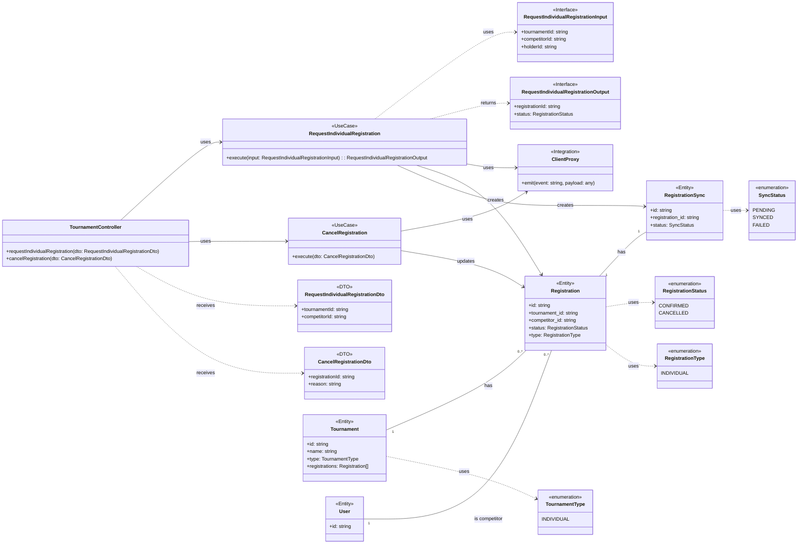

# Technical Specification: Individual Registration

## 1. Executive Summary

This document is the second of three specifications for the tournament feature, building upon the approved **Tournament Management** spec. It details the technical implementation for a user to register for an **individual** tournament.

The solution extends the `TournamentModule` by introducing `Registration` and `RegistrationSync` entities. It defines the use cases for requesting and canceling an individual registration, which will be handled through the existing `TournamentController`. Upon confirmation, a `registration.confirmed` event is published to RabbitMQ to decouple subsequent processes like sending notifications.

## 2. System Architecture

### 2.1. Component Overview

This spec introduces the following components to the existing `TournamentModule`:

-   **Use Cases:**
    -   `RequestIndividualRegistration`: Handles the creation of a registration for a single competitor.
    -   `CancelRegistration`: Handles the cancellation of a registration.
-   **Prisma Models:** `Registration` and `RegistrationSync` entities will be added to the `schema.prisma` file, and the `Tournament` model will be updated to include the relation.
-   **Integration:** A `ClientProxy` instance will be used to publish events to RabbitMQ.

## 3. Implementation Design

### 3.1. Contracts (DTOs and Interfaces)

#### 3.1.1. Data Transfer Objects (DTOs)

```typescript
// src/infraestructure/dtos/tournament/request-individual-registration.dto.ts
import { IsString, IsNotEmpty } from 'class-validator';

export class RequestIndividualRegistrationDto {
  @IsString()
  @IsNotEmpty()
  tournamentId: string;

  @IsString()
  @IsNotEmpty()
  competitorId: string; // ID of the Dependant
}

// src/infraestructure/dtos/tournament/cancel-registration.dto.ts
import { IsString, IsNotEmpty } from 'class-validator';

export class CancelRegistrationDto {
  @IsString()
  @IsNotEmpty()
  registrationId: string;

  @IsString()
  @IsNotEmpty()
  reason: string;
}
```

#### 3.1.2. Use Case Interfaces

```typescript
// src/application/use-cases/tournament/request-individual-registration.ts
export interface RequestIndividualRegistrationInput {
  tournamentId: string;
  competitorId: string;
  holderId: string; // ID of the User making the request
}

export interface RequestIndividualRegistrationOutput {
  registrationId: string;
  status: RegistrationStatus;
}
```

### 3.2. Data Model (Prisma Schema)

This section formally defines the `Registration` and `RegistrationSync` models and updates the `Tournament` model.

```prisma
// prisma/schema.prisma

model Tournament {
  id                      String    @id @default(uuid())
  name                    String
  description             String
  type                    TournamentType
  registration_start_date DateTime
  registration_end_date   DateTime
  start_date              DateTime
  deleted_at              DateTime?
  created_at              DateTime  @default(now())
  updated_at              DateTime  @updatedAt

  // Relation is now active
  registrations           Registration[] 

  @@map("tournaments")
}

model Registration {
  id                 String             @id @default(uuid())
  tournament         Tournament         @relation(fields: [tournament_id], references: [id])
  tournament_id      String
  competitor         User               @relation(fields: [competitor_id], references: [id])
  competitor_id      String
  status             RegistrationStatus
  type               RegistrationType

  // Duo-specific fields will be handled in the next spec
  // partnerRequest     Registration?      @relation("DuoPartner", fields: [partner_request_id], references: [id])
  // partner_request_id   String?
  // inversePartnerRequest Registration?

  sync               RegistrationSync?
  created_at         DateTime           @default(now())
  updated_at         DateTime           @updatedAt

  @@map("registrations")
  @@unique([tournament_id, competitor_id])
}

model RegistrationSync {
  id              String       @id @default(uuid())
  registration    Registration @relation(fields: [registration_id], references: [id])
  registration_id String       @unique
  status          SyncStatus   @default(PENDING)
  attempts        Int          @default(0)
  last_attempt_at DateTime?
  created_at      DateTime     @default(now())
  updated_at      DateTime     @updatedAt

  @@map("registration_syncs")
}

enum RegistrationType {
  INDIVIDUAL
  // DUO_INCOMPLETE
  // DUO_COMPLETE
}

enum RegistrationStatus {
  CONFIRMED
  CANCELLED
}

enum SyncStatus {
  PENDING
  SYNCED
  FAILED
}
```

### 3.3. Business Logic

-   **RequestIndividualRegistration:**
    1.  Verify the tournament exists, is of type `INDIVIDUAL`, and is within the registration period.
    2.  Verify the `competitorId` and `holderId` are valid and linked.
    3.  Within a single database transaction, create a `Registration` record with `type: INDIVIDUAL` and `status: CONFIRMED`, and create a corresponding `RegistrationSync` record with `status: PENDING`.
    4.  If the database write fails due to the `@@unique` constraint, throw a `ConflictException` (which NestJS maps to a 409 HTTP status).
    5.  Publish a `registration.confirmed` event.
-   **CancelRegistration:**
    1.  Verify the registration exists.
    2.  Update the registration `status` to `CANCELLED`.
    3.  Publish a `registration.cancelled` event.

### 3.4. API Endpoints

-   `POST /tournaments/registrations/request-individual`
-   `POST /tournaments/registrations/cancel`

### 3.5. Integration

#### 3.5.1. RabbitMQ Publisher

Event publishing will be handled by a `ClientProxy` instance provided by the `@nestjs/microservices` package. This client will be configured in the `TournamentModule` using `ClientsModule.register()`.

-   **Configuration:**
// see example in: src/shared/modules/club-request.module.ts and refactor.
    ```typescript
    // src/application/modules/tournament.module.ts
    ClientsModule.register([
      {
        name: 'TOURNAMENT_SERVICE',
        transport: Transport.RMQ,
        options: {
          urls: ['amqp://localhost:5672'],
          queue: 'tournaments_queue',
        },
      },
    ]),
    ```

-   **Publishing:** The use cases will inject the `ClientProxy` using `@Inject('TOURNAMENT_SERVICE')` and call the `emit()` method to publish events.

    ```typescript
    this.client.emit('registration.confirmed', payload);
    ```

## 4. Testing Approach

-   **Unit Tests:**
    -   `describe('(UNIT) RequestIndividualRegistration', () => { ... })`
        -   `it('Deve criar um registro individual com sucesso', () => { ... })`
        -   `it('Não deve criar um registro para um torneio que não seja individual', () => { ... })`
        -   `it('Não deve criar um registro fora do período de inscrição', () => { ... })`
        - 
-   **E2E Tests:**
    -   `describe('(E2E) Tournament', () => { ... })`
        -   `it('Deve criar um registro individual com sucesso', () => { ... })`
        -   `it('Deve cancelar um registro com sucesso', () => { ... })`
        -   `it('Não deve permitir o mesmo competidor se registrar duas vezes', () => { ... })`

## 5. Risks and Considerations

-   **Idempotency:** The `@@unique([tournament_id, competitor_id])` constraint in the `Registration` model, combined with specific error handling to return a 409 status, provides robust idempotency.
-   **Atomicity:** The transactional outbox pattern (creating `Registration` and `RegistrationSync` in one DB transaction) is critical for data consistency. The actual publishing to RabbitMQ is handled by a separate worker process that reads from the `RegistrationSync` table. This is managed by the implemented Unit of Work pattern (`src/domain/services/unit-of-work.ts`).
-   **Outbox Worker:** For the initial implementation, a new controller will be created with a method decorated with `@EventPattern('registration.confirmed')`. This method will be responsible for processing the event, marking the `RegistrationSync` record as `SYNCED`. This is a temporary measure until the external tournament system's API is available.

## 6. Diagrams

### 6.1. Class Diagram

O diagrama a seguir ilustra as principais entidades, DTOs, casos de uso e suas relações, conforme descrito nesta especificação.


